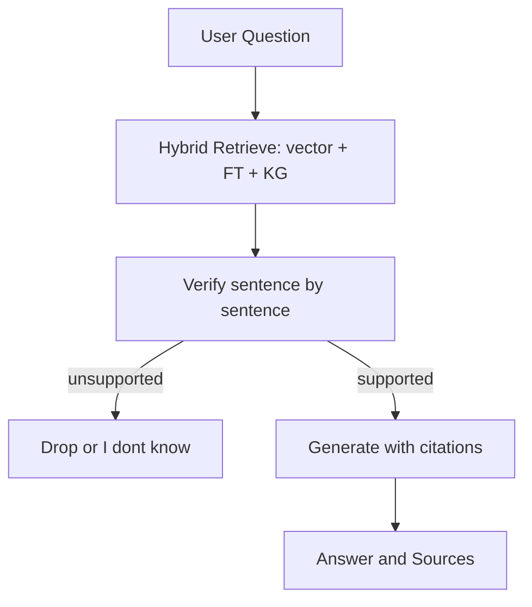

# Retrieval & Verification

## Principles

- **Docs-only**: Answers come strictly from approved Toll sources (About/History/Services)
- **Hybrid retrieval**: Vector similarity + full-text + small KG boosts (all in Neo4j)
- **Sentence-level verification**: Every sentence must be backed by a quote; otherwise it's dropped or replaced with "I don't know from the provided Toll documents"
- **Clear citations**: Inline markers + a "Sources" list (title + URL)
- **Safety routing**: Operational/medical requests → guardrails (no SOPs or live guidance)

## Retrieval Stack (Neo4j)

- **Vector indexes**: Per-service (`uas`, `ace`, later `aero_fixed`, `defence`) and a global index
- **Full-text index**: BM25-style keyword search over chunks
- **KG boost**: Use nearby entities (platforms, bases, programs, courses) to expand the query

## Retrieval Flow (MVP)

1. **Normalize + scope**: Detect service (if any)
2. **Search**:
   - Vector top 12 in the scoped index (fallback to global)
   - Full-text top 12
3. **Merge & expand (optional)**: Expand with 1-hop KG terms; run a second pass if initial recall is weak
4. **Rerank** to top k=5 (cross-encoder or LLM reranker)

## Verification Flow

For each **candidate sentence** in the draft answer:

- Find ≥1 **supporting quote** from retrieved chunks (include page title + URL)
- Assign **confidence** (high/medium/low)
- **Drop** sentences with no support or **mark unknown**

If overall support is poor → respond with a concise **"I don't know…"** message.

## Output Format (to UI)

- Short bullets or concise paragraphs
- **Inline citations** (e.g., [1], [2]) and a **Sources** section listing title + URL
- Related topics (from KG neighbors) may appear in the right-rail

## Supported Query Types (Now)

- **About Toll Aviation** (mission, sectors, workforce)
- **History / Timeline** (e.g., 2014 NSW/ACT contract, 2016 ACE opening, awards)
- **Services** overview (UAS, ACE; later Fixed-Wing/Aeromedical, Defence)

## Retrieval Flow Diagram

