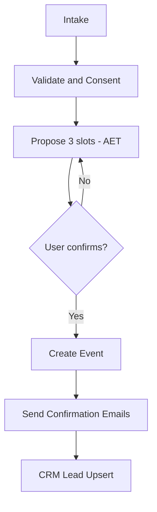

# Contact Flows

## Fields (General "Contact us")

- First Name (required)
- Last Name (required)
- Email (required)
- Phone (required)
- Company (optional)
- Reason for enquiry (required)
- Message (required)
- Consent to be contacted / privacy acknowledgement

## Triage (where each enquiry goes)

- **Training Enquiry** → ACE (simulators/courses) **or** UAS Training (detect via keywords)
- **Operational Enquiry** → **ops_guarded** (no SOPs or live guidance; offer to book a consult)
- **Media Enquiry** → Media/Comms inbox (+ optional call booking)
- **Invite Toll to Tender** → BD/Tenders workflow (collect RFT/RFQ refs)
- **Other** → basic Q&A; if needed, hand-off to human inbox

## Book Appointment (meeting)

1. Intake the fields above; validate email/phone; confirm consent
2. Propose **3 time options** via calendar (Timezone: **Australia/Melbourne**)
3. On confirm: create event; email confirmations to the user + correct team inbox; upsert CRM lead

## Arrange Call

Same as booking, but event type = **phone/virtual call**. Include 1800 776 902 or a VC link in the confirmation.

## Send Email

Compose a concise summary and send to the right inbox (ACE / UAS / Media / Tenders / General), CC the requester, and log in CRM.

## Operational Enquiry (guarded)

Politely refuse operational SOPs or real-time medical/flight guidance. Provide official channels (e.g., **1800 776 902**, relevant team inbox). Offer a consult booking instead.

## MCP Tools Used

- `validate.contact({email, phone})`
- `calendar.find_slots(participants, duration, window, tz)`
- `calendar.create_event(title, start, end, attendees, notes)`
- `email.send(to, cc, subject, html, thread_key)`
- `crm.upsert_lead(lead_json)`
- (router/guardrails are handled before these flows)

## Data Contracts (Examples)

### lead.json
```json
{
  "first_name": "",
  "last_name": "",
  "email": "",
  "phone": "",
  "company": "",
  "reason": "training|operational|media|tender|other",
  "service": "uas|ace|aero_fixed|defence|unknown",
  "message": "",
  "consent": { "privacy": true, "contact": true },
  "tz": "Australia/Melbourne",
  "source": { "channel": "chatbot" }
}
```

### event.json
```json
{
  "title": "Intro — {service}",
  "start": "",
  "end": "",
  "attendees": [
    { "name": "", "email": "" },
    { "name": "Team", "email": "uncrewedsystems@tollgroup.com" }
  ],
  "location": "Video Conference",
  "notes": "Reason: ...",
  "reminders": [10]
}
```

## Flow Diagram

