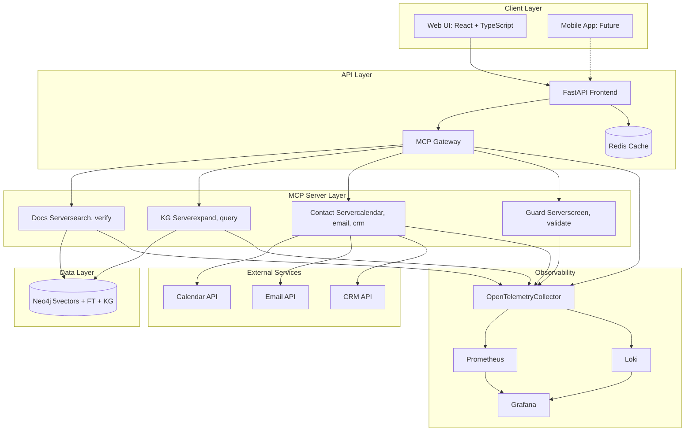
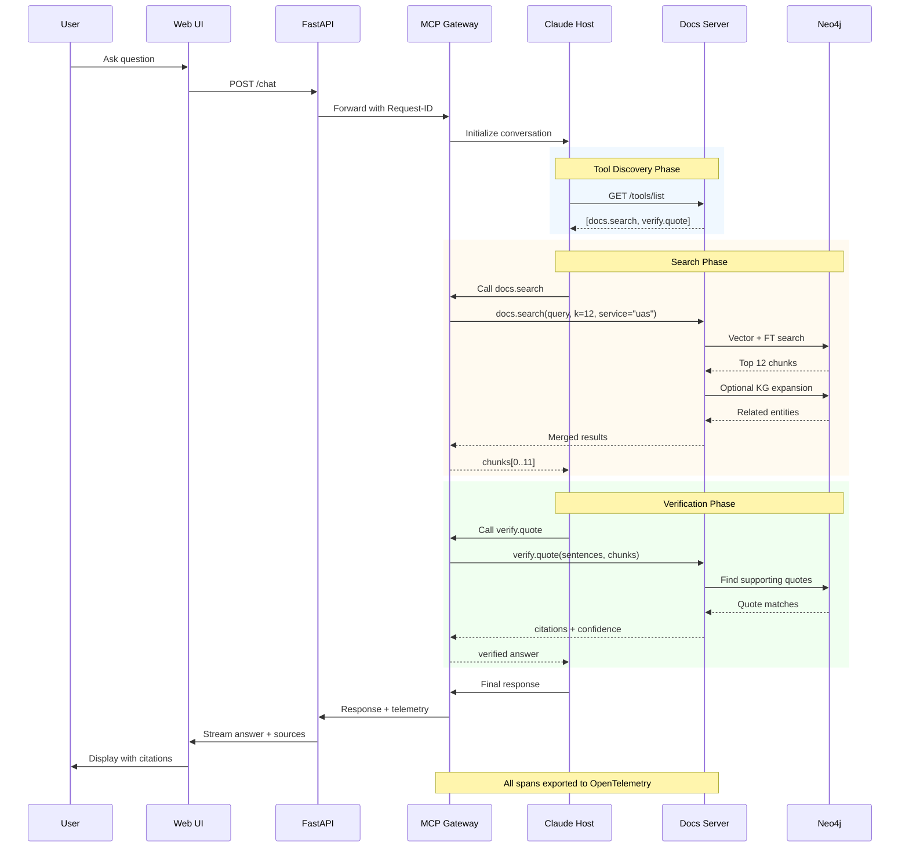
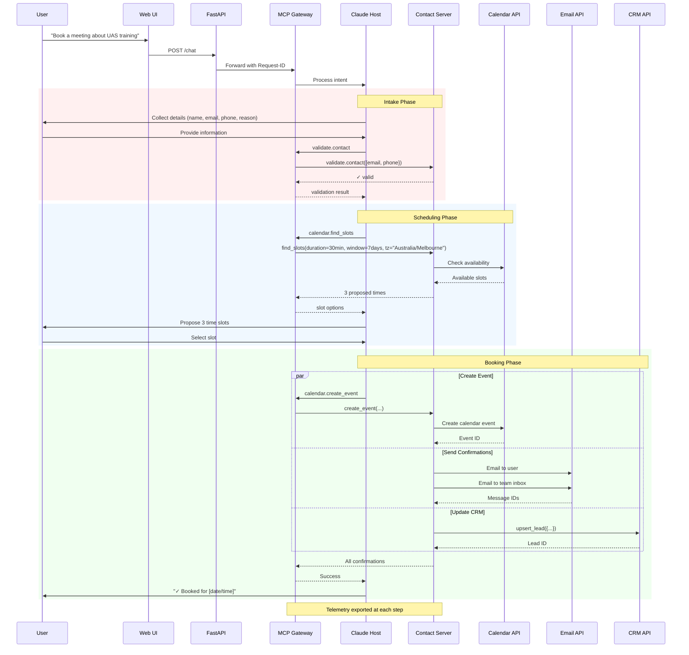
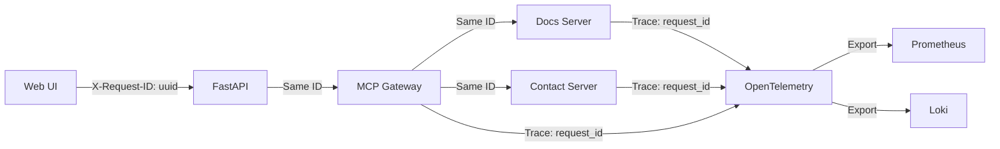
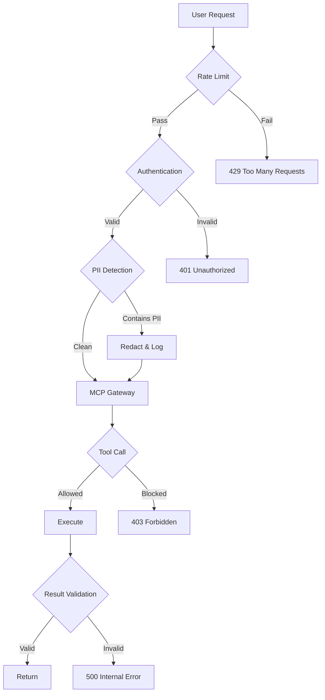

# Architecture v2 (Simplified MCP)

## Design Principles

- **Claude Host orchestrates** - No separate LangGraph orchestrator needed for MVP
- **Stateless MCP servers** - Each server is independently scalable
- **Gateway pattern** - Single entry point for auth, rate limiting, request tracking
- **Observable by default** - OpenTelemetry spans on every tool call
- **PII-safe logging** - Automatic redaction in all log outputs

---

## High-Level Architecture


---

## Component Details

### 1. Frontend (React + TypeScript)
- Chat interface with streaming responses
- Citation display with clickable sources
- Contact forms with validation
- Booking calendar widget
- Mobile-responsive design

### 2. FastAPI Frontend API
- Session management
- WebSocket for streaming
- Static asset serving
- Rate limiting per user/IP
- CORS configuration

### 3. MCP Gateway
**Responsibilities:**
- Request ID generation and propagation
- Authentication and authorization
- Rate limiting (by client, by tool)
- Request/response logging (PII-redacted)
- Health check aggregation
- Circuit breaking for external services

**Not included in MVP:**
- Complex orchestration (Claude Host does this)
- Business logic (lives in MCP servers)

### 4. MCP Servers (Stateless)

#### Docs Server
**Tools:**
- `docs.search(query, k, service?)`
- `verify.quote(sentences, chunks, threshold)`

**Features:**
- Hybrid search (vector + full-text + KG boost)
- Sentence-level verification
- Citation generation
- PII detection and redaction

#### KG Server
**Tools:**
- `kg.query(cypher)`
- `kg.expand(entities, depth)`

**Features:**
- Ontology navigation
- Entity relationship exploration
- Timeline queries
- Service-scoped subgraph queries

#### Contact Server
**Tools:**
- `calendar.find_slots(participants, duration, window, tz)`
- `calendar.create_event(title, start, end, attendees, notes)`
- `email.send(to, cc, subject, html, thread_key)`
- `crm.upsert_lead(lead_json)`
- `validate.contact({email, phone})`

**Features:**
- Multi-calendar coordination
- Email template rendering
- CRM field mapping
- GDPR consent handling

#### Guard Server
**Tools:**
- `guardrails.screen(message)`

**Features:**
- Prompt injection detection
- Data leak prevention
- Operational/medical request screening
- Escalation routing

### 5. Data Layer

#### Neo4j 5
- **Vector indexes**: Per-service (uas, ace) + global
- **Full-text indexes**: BM25 over chunks
- **Knowledge graph**: Org, Service, Program, Capability, Platform, Course, etc.
- **Backup**: Daily automated snapshots

#### Redis
- Session cache (30-min TTL)
- API response cache (configurable per endpoint)
- Rate limit counters
- Distributed locks for booking

### 6. Observability Stack

#### OpenTelemetry
- **Traces**: End-to-end request tracking
- **Metrics**: Tool call counts, latencies, errors
- **Logs**: Structured JSON with request IDs

#### Prometheus + Grafana
- SLO dashboards (p95 latency, error rates)
- Capacity planning metrics
- Alert rules for SLO breaches

#### Loki
- Centralized log aggregation
- PII-redacted audit logs
- Retention: 90 days hot, 1 year cold

---

## Detailed Request Flow

### Ask-Docs Flow


### Contact Flow


---

## Request Tracking & Observability

### Request ID Propagation


### Instrumentation Points

Every MCP tool call automatically captures:

1. **Request metadata**
   - Request ID
   - Tool name
   - Parameters (PII-redacted)
   - Calling service

2. **Timing data**
   - Start time
   - Duration
   - Queue time (if applicable)

3. **Result metadata**
   - Success/failure
   - Result size
   - Cache hit/miss
   - Error type (if failed)

4. **Business metrics**
   - Search result count
   - Verification confidence
   - Booking completion rate
   - Escalation triggers

---

## Deployment Architecture

### Development
```
┌─────────────────┐
│  Local Machine  │
│  - React dev    │
│  - FastAPI      │
│  - Neo4j Docker │
│  - Redis Docker │
└─────────────────┘
```

### Staging
```
┌──────────────────────────┐
│    Azure/AWS/GCP         │
│  ┌────────────────────┐  │
│  │  App Service       │  │
│  │  - Frontend + API  │  │
│  └────────────────────┘  │
│  ┌────────────────────┐  │
│  │  Container Instances│ │
│  │  - MCP Servers (4) │  │
│  └────────────────────┘  │
│  ┌────────────────────┐  │
│  │  Managed Services  │  │
│  │  - Neo4j Aura      │  │
│  │  - Redis Cache     │  │
│  └────────────────────┘  │
└──────────────────────────┘
```

### Production
```
┌────────────────────────────────┐
│    Kubernetes Cluster          │
│  ┌──────────────────────────┐  │
│  │  Frontend Pods (3x)      │  │
│  │  - React + FastAPI       │  │
│  │  - Auto-scaling          │  │
│  └──────────────────────────┘  │
│  ┌──────────────────────────┐  │
│  │  MCP Server Pods         │  │
│  │  - Docs (3x)             │  │
│  │  - Contact (2x)          │  │
│  │  - KG (2x)               │  │
│  │  - Guard (2x)            │  │
│  └──────────────────────────┘  │
│  ┌──────────────────────────┐  │
│  │  Stateful Sets           │  │
│  │  - Neo4j cluster (3x)    │  │
│  │  - Redis cluster (3x)    │  │
│  └──────────────────────────┘  │
│  ┌──────────────────────────┐  │
│  │  Observability           │  │
│  │  - Prometheus            │  │
│  │  - Grafana               │  │
│  │  - Loki                  │  │
│  │  - Jaeger (traces)       │  │
│  └──────────────────────────┘  │
└────────────────────────────────┘
```

---

## Key Architectural Decisions

### ✅ What Changed from v1

| Aspect | v1 (Original) | v2 (Simplified) |
|--------|---------------|-----------------|
| Orchestration | LangGraph agent | Claude Host native |
| MCP Access | Direct from orchestrator | Through Gateway |
| Request Tracking | Manual | Automatic (Request ID) |
| Observability | Planned | Built-in (OpenTelemetry) |
| State Management | In orchestrator | Stateless servers |
| Scalability | Vertical (orchestrator) | Horizontal (servers) |

### 🎯 Why These Changes

1. **Removed LangGraph** - Claude Host already orchestrates tool calls intelligently. Adding LangGraph adds complexity without value for MVP.

2. **Added MCP Gateway** - Centralized auth, rate limiting, and request tracking. Easier to secure and monitor.

3. **Stateless Servers** - Each MCP server can scale independently based on load. No shared state = no bottlenecks.

4. **Observability First** - Built-in tracing means debugging production issues is straightforward.

5. **PII Safety** - Automatic redaction at gateway level protects customer data.

---

## Performance Targets

| Metric | Target | Measurement |
|--------|--------|-------------|
| Ask-Docs p95 | ≤ 3s | OpenTelemetry span |
| Booking E2E p95 | ≤ 6s | Multi-span trace |
| Availability | 99.5% | Health checks |
| Cache Hit Rate | ≥ 40% | Redis metrics |
| Error Rate | < 1% | Tool call success rate |

---

## Security Layers


---

## Migration Path (v1 → v2)

### Phase 1: Add Gateway (Week 1)
- Deploy MCP Gateway in front of existing servers
- Add request ID propagation
- No breaking changes

### Phase 2: Remove LangGraph (Week 2)
- Update API to call Claude Host directly
- Migrate state management to Redis
- Test all workflows

### Phase 3: Add Observability (Week 3)
- Deploy OpenTelemetry collectors
- Add instrumentation to servers
- Create Grafana dashboards

### Phase 4: Optimize (Week 4)
- Add Redis caching
- Tune Neo4j indexes
- Load testing and optimization

---

## Related Documentation

- [MCP Sequence Diagrams](./mcp-sequence.md) - Original sequence flows
- [System Flow](./system-flow.md) - Original architecture
- [Tech Stack](../70-tech-stack-infra/README.md) - Technology choices
- [Security & Privacy](../80-security-privacy/README.md) - Security controls
