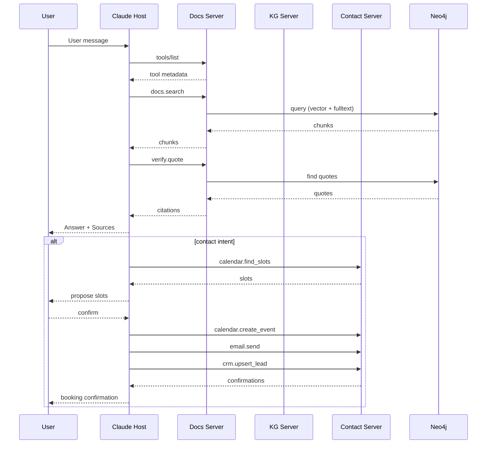

# MCP Lifecycle (Claude Host to Servers)

```mermaid
sequenceDiagram
  participant U as User
  participant H as Claude Host
  participant D as Docs Server
  participant K as KG Server
  participant C as Contact Server
  participant N as Neo4j
  U->>H: User message
  H->>D: tools/list
  D-->>H: tool metadata
  H->>D: docs.search
  D->>N: query (vector + fulltext)
  N-->>D: chunks
  D-->>H: chunks
  H->>D: verify.quote
  D->>N: find quotes
  N-->>D: quotes
  D-->>H: citations
  H-->>U: Answer + Sources
  alt contact intent
    H->>C: calendar.find_slots
    C-->>H: slots
    H-->>U: propose slots
    U-->>H: confirm
    H->>C: calendar.create_event
    H->>C: email.send
    H->>C: crm.upsert_lead
    C-->>H: confirmations
    H-->>U: booking confirmation
  end
```
