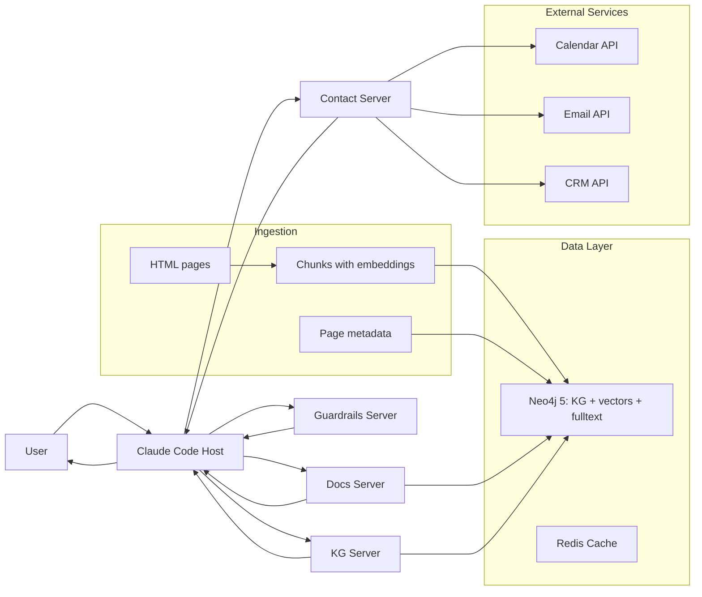

# End-to-End System Flow

## System Architecture Diagram

```mermaid
flowchart LR
  U[User] --> H[Claude Code Host]
  %% MCP servers
  H --> S1[Docs Server]
  H --> S2[KG Server]
  H --> S3[Contact Server]
  H --> S4[Guardrails Server]
  %% Data layer
  subgraph DATA[Data Layer]
    N[Neo4j 5: KG + vectors + fulltext]
    R[Redis Cache]
  end
  %% Ingestion
  subgraph INGEST[Ingestion]
    P[HTML pages]
    C[Chunks with embeddings]
    M[Page metadata]
  end
  P --> C --> N
  M --> N
  %% Server data access
  S1 --> N
  S2 --> N
  %% External services
  subgraph EXT[External Services]
    CAL[Calendar API]
    MAIL[Email API]
    CRM[CRM API]
  end
  S3 --> CAL
  S3 --> MAIL
  S3 --> CRM
  %% Response paths
  S1 --> H
  S2 --> H
  S4 --> H
  S3 --> H
  H --> U
```
