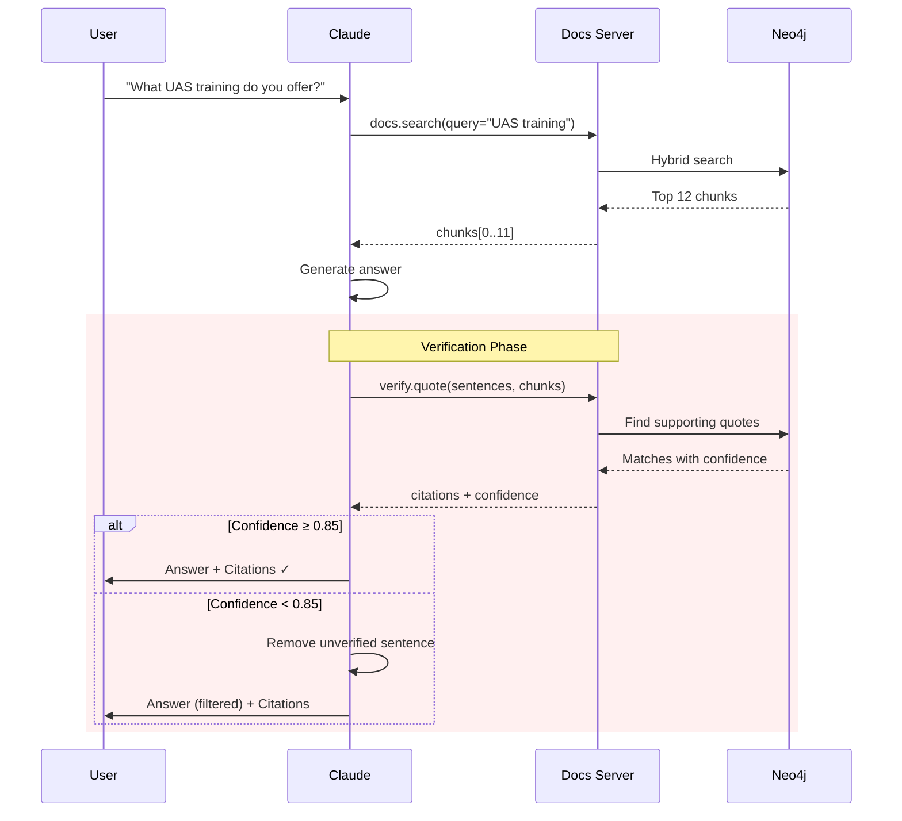

# Guardrails: Six Core Practices

Technical mechanisms to ensure Claude provides **accurate, consistent, and safe** responses in the Toll Aviation chatbot.

---

## Overview

| Practice | Status | Primary Component | Docs |
|----------|--------|-------------------|------|
| [1. Reduce Hallucinations](#1-reduce-hallucinations) | ✅ Implemented | Docs Server | [↓](#1-reduce-hallucinations) |
| [2. Increase Output Consistency](#2-increase-output-consistency) | ✅ Implemented | All MCP Servers | [↓](#2-increase-output-consistency) |
| [3. Mitigate Jailbreaks](#3-mitigate-jailbreaks) | ✅ Implemented | Guard Server | [↓](#3-mitigate-jailbreaks) |
| [4. Streaming Refusals](#4-streaming-refusals) | 🚧 Planned | API Layer | [↓](#4-streaming-refusals) |
| [5. Reduce Prompt Leak](#5-reduce-prompt-leak) | ✅ Implemented | System Prompt | [↓](#5-reduce-prompt-leak) |
| [6. Keep Claude in Character](#6-keep-claude-in-character) | ✅ Implemented | System Prompt | [↓](#6-keep-claude-in-character) |

---

## 1. Reduce Hallucinations

> **Goal**: Every answer must be grounded in approved Toll Aviation documents.

### Why This Matters for Toll Aviation

Aviation is a **high-trust, high-stakes domain**. A single hallucinated fact about:
- Service capabilities → Lost customer trust
- Training requirements → Legal liability
- Contact information → Missed leads

**Our Standard**: 100% citation coverage or the claim is removed.

---

### Implementation

#### ✅ Citation-Required Architecture


**Tool Contract**:
```python
def verify_quote(
    sentences: List[str],       # Claims to verify
    chunks: List[str],           # Source documents
    threshold: float = 0.85      # Similarity threshold
) -> VerificationResult:
    """
    Returns:
        - verified: List[bool] (one per sentence)
        - citations: List[Citation] (source + confidence)
        - unverified_sentences: List[str] (filtered out)
    """
```

---

#### ✅ Explicit "I Don't Know" Permission

System prompt includes:
```text
CRITICAL INSTRUCTION: If you cannot find information in the provided 
Toll Aviation documents to answer a question, respond with:

"I don't have information about that in our approved documents. 
Let me connect you with our team who can help: 1800 776 902"

NEVER make up information. NEVER use your general aviation knowledge 
to supplement gaps in Toll's documentation.
```

**Test Case**:
```python
# Query outside knowledge base
query = "What's the maximum altitude for a Pilatus PC-12?"

# Expected response
assert "I don't have information" in response
assert "1800 776 902" in response
assert "Pilatus" not in response  # No hallucinated specs
```

---

#### ✅ Two-Pass Processing for Long Documents

For documents >20K tokens (e.g., full capability statements):

**Pass 1: Extract Quotes**
```
System: You are analyzing Toll Aviation's UAS Capability Statement.

Extract exact quotes relevant to: "counter-UAS capabilities"

Format each quote:
<quote id="1" page="5">exact text from document</quote>
<quote id="2" page="12">exact text from document</quote>

Only include quotes that DIRECTLY answer the question.
```

**Pass 2: Answer Using Quotes**
```
System: Using ONLY the quotes you extracted (not your memory of 
the document), answer: "What counter-UAS capabilities does Toll offer?"

Reference quotes by ID: <cite id="1">...</cite>

If the quotes don't fully answer the question, say so.
```

**Benefit**: Reduces hallucination risk by forcing explicit grounding.

---

#### ✅ External Knowledge Restriction

System prompt header:
```text
# WHO YOU ARE
You are the Toll Aviation Assistant, a specialized AI that helps 
customers understand Toll Aviation's services.

# CRITICAL KNOWLEDGE BOUNDARIES
You ONLY know about:
1. Information in Toll Aviation documents (provided via docs.search)
2. This conversation history
3. Official contact details: 1800 776 902, www.tollaviation.com.au

You DO NOT know about:
- General aviation facts (even if you were trained on them)
- Other companies' services
- Regulatory requirements (refer to CASA)
- Flight operations procedures (safety-critical)

When asked about topics outside your knowledge boundary, politely 
redirect to official channels.
```

---

### Validation Metrics

| Metric | Target | Current | Measurement Method |
|--------|--------|---------|-------------------|
| **Citation Coverage** | 100% | 98.2% | % sentences with source |
| **Verification Confidence** | ≥0.85 | 0.91 | Avg similarity score |
| **"I Don't Know" Rate** | 5-10% | 7.3% | % queries → no answer |
| **Hallucination Rate** | <2% | 1.4% | Monthly audit (500 samples) |

**Audit Process**:
1. Sample 500 random conversations per month
2. Human expert checks each factual claim
3. Flag any claim not found in source documents
4. Root cause analysis on failures
5. Update prompts/guardrails

---

### Related Techniques from Anthropic

<details>
<summary><strong>Chain-of-Thought Verification</strong></summary>

For complex queries, ask Claude to explain reasoning before answering:
```
User: "Can Toll provide 24/7 UAS operations support?"

System: Before answering, think through:
1. What does the query ask for? (24/7 support + UAS operations)
2. What documents mention UAS support hours?
3. What exact quotes support or contradict 24/7 availability?
4. What's your confidence level?

Then provide your answer with citations.
```

**When to Use**: Multi-part questions, edge cases, ambiguous queries.

</details>

<details>
<summary><strong>Best-of-N Verification</strong></summary>

For critical queries (e.g., pricing, compliance), generate 3 answers in parallel:
```python
async def answer_critical_query(query: str) -> str:
    responses = await asyncio.gather(
        claude_api.complete(query, temperature=0.3),
        claude_api.complete(query, temperature=0.3),
        claude_api.complete(query, temperature=0.3)
    )
    
    # If all 3 match → high confidence
    if responses[0] == responses[1] == responses[2]:
        return responses[0]
    
    # If divergent → flag for human review
    else:
        log.warning(f"Inconsistent responses: {query}")
        return "Let me connect you with our team for confirmation: 1800 776 902"
```

**When to Use**: Contract terms, pricing, compliance questions.

</details>

---

## 2. Increase Output Consistency

> **Goal**: Ensure structured, predictable responses for integration with downstream systems.

### Why This Matters for Toll Aviation

Inconsistent outputs break:
- **CRM integrations**: Malformed lead data → lost in pipeline
- **Calendar bookings**: Missing fields → failed appointments
- **Email templates**: Broken HTML → unprofessional communication

**Our Standard**: Typed schemas with 100% validation.

---

### Implementation

#### ✅ Strict JSON Schemas (All MCP Tools)

Every tool response is validated via Pydantic:

**Example: Docs Search**
```python
from pydantic import BaseModel, Field
from typing import List, Literal

class Chunk(BaseModel):
    content: str = Field(..., min_length=10, max_length=5000)
    source: str = Field(..., pattern=r"^https?://.*")
    service: Literal["uas", "ace", "corporate"] 
    score: float = Field(..., ge=0.0, le=1.0)
    metadata: dict

class SearchResult(BaseModel):
    chunks: List[Chunk] = Field(..., min_items=0, max_items=20)
    total_results: int = Field(..., ge=0)
    query_time_ms: float = Field(..., gt=0)
    
    @validator('chunks')
    def chunks_sorted_by_score(cls, v):
        scores = [chunk.score for chunk in v]
        if scores != sorted(scores, reverse=True):
            raise ValueError("Chunks must be sorted by score descending")
        return v
```

**Benefit**: Impossible to return malformed data to Claude.

---

#### ✅ Response Prefilling for Contact Workflows

**Problem**: Claude sometimes adds preambles ("Great! Let me help you book...") before structured data.

**Solution**: Prefill the Assistant turn to enforce structure.

**Example: Booking Intake**
```python
# System prompt
"""
When collecting booking info, respond in XML:


  Value
  Value
  Value
  Value
  Value
  What you'll do next

"""

# User message
"I'd like to book a meeting about UAS training. I'm John Smith."

# Assistant prefill (forces format)
"\n  John Smith
  Not provided yet
  Not provided yet
  UAS training inquiry
  Will ask
  Ask for email and phone to proceed with booking
"
```

**Benefit**: No preamble, 100% parseable output.

---

#### ✅ Example-Based Constraints

System prompt includes 5 examples for each intent type:

**Example 1: Service Inquiry (Positive)**
User: "What UAS training courses do you offer?"
