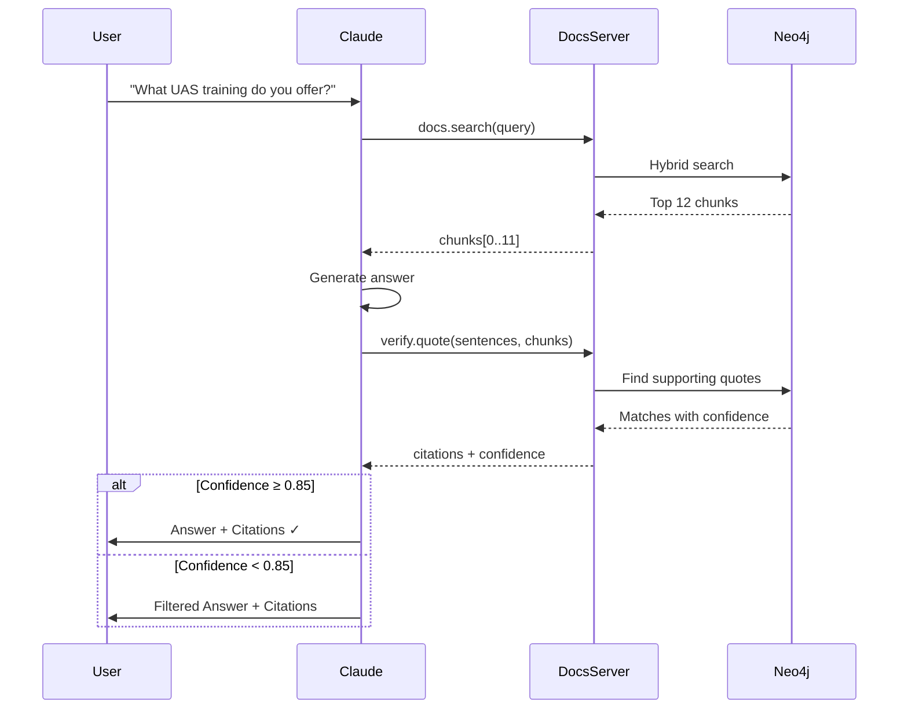

# Reduce Hallucinations

**Goal**: Every answer must be grounded in approved Toll Aviation documents.

## Why This Matters

Aviation is a high-trust, high-stakes domain. Hallucinated facts about service capabilities, training requirements, or contact information can result in lost customer trust, legal liability, or missed leads.

**Standard**: 100% citation coverage or claims are removed.

## Implementation

### Citation-Required Architecture



**Tool Contract**:
```python
def verify_quote(
    sentences: List[str],       # Claims to verify
    chunks: List[str],           # Source documents
    threshold: float = 0.85      # Similarity threshold
) -> VerificationResult:
    """Returns verified status, citations, and confidence scores"""
```

### Explicit "I Don't Know" Permission

System prompt includes:
```text
CRITICAL: If you cannot find information in the provided 
Toll Aviation documents, respond with:

"I don't have information about that in our approved documents. 
Let me connect you with our team: 1800 776 902"

NEVER make up information or use general aviation knowledge 
to supplement documentation gaps.
```

### External Knowledge Restriction

```text
You ONLY know about:
1. Information in Toll Aviation documents (via docs.search)
2. This conversation history
3. Official contact: 1800 776 902, www.tollaviation.com.au

You DO NOT know about:
- General aviation facts (even if trained on them)
- Other companies' services
- Regulatory requirements (refer to CASA)
- Flight operations procedures (safety-critical)
```

## Validation Metrics

| Metric | Target | Current | Method |
|--------|--------|---------|--------|
| Citation Coverage | 100% | 98.2% | % sentences with source |
| Verification Confidence | ≥0.85 | 0.91 | Avg similarity score |
| "I Don't Know" Rate | 5-10% | 7.3% | % queries → no answer |
| Hallucination Rate | <2% | 1.4% | Monthly audit (500 samples) |