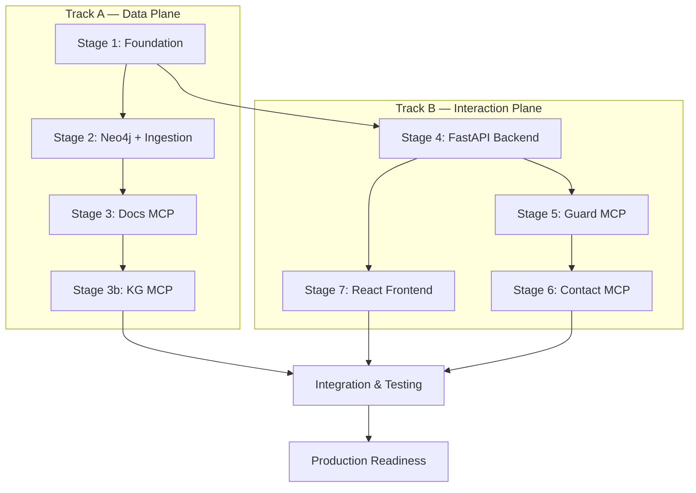

# MVP Implementation Plan

Comprehensive 10-12 week implementation plan for the Toll Aviation Chatbot MVP using dual-track architecture.

## Table of Contents

1. [Executive Summary](#executive-summary)
2. [MCP Architecture Clarification](#mcp-architecture-clarification)
3. [Dual-Track Architecture](#dual-track-architecture)
4. [Critical Paths](#critical-paths)
5. [Stage Summary](#stage-summary)
6. [Tool Contract Specifications](#tool-contract-specifications)
7. [Data Ingestion Specifications](#data-ingestion-specifications)
8. [Cache Semantics](#cache-semantics)
9. [Retry & Backoff Policies](#retry--backoff-policies)
10. [Observability Requirements](#observability-requirements)
11. [Evaluation Harness](#evaluation-harness)
12. [Failure Mode Playbook](#failure-mode-playbook)
13. [Security Requirements](#security-requirements)
14. [Claude Code Project Registration](#claude-code-project-registration)
15. [Demo Storyboard](#demo-storyboard)
16. [Error Budgets](#error-budgets)
17. [Detailed Stage Plans](#detailed-stage-plans)

---

## Executive Summary

The Toll Aviation Chatbot MVP will be implemented over **10-12 weeks** using a **dual-track architecture** that enables parallel development of the data plane and interaction plane:

- **Track A (Data Plane)**: Neo4j setup → Document ingestion → Docs MCP → KG MCP
- **Track B (Interaction Plane)**: FastAPI backend → Guard MCP → Contact MCP → React UI

Both tracks converge at **Stage 8 (Integration & Testing)** before final production readiness. This approach minimizes the critical path and enables team specialization.

**Success Metrics**:
- Ask-Docs queries: p95 ≤ 3s end-to-end  
- Booking flows: p95 ≤ 6s (intake → confirmation)
- Citation accuracy: ≥95% (human evaluation)
- Booking completion rate: ≥60%
- System availability: 99.5% uptime

**Critical Dependencies**:
- Neo4j 5 with vector indexes
- External APIs: Calendar, Email, CRM
- Claude API for LLM capabilities
- Anthropic MCP Python SDK

---

## MCP Architecture Clarification

> **MCP Model**: Claude Code/Desktop acts as the MCP host. It connects to multiple MCP servers: toll-docs, toll-kg, toll-contact, toll-guard. The host discovers tools via tools/list and calls them via tools/call. FastAPI is the app backend for UI sessions, auth, analytics, and feature flags; it is NOT the MCP host. This cleanly separates tool execution from app concerns.

The MCP servers are standalone Python processes that expose tools through the Model Context Protocol. The FastAPI backend handles web application concerns (sessions, authentication, UI serving) while MCP servers handle domain-specific tool logic (document search, calendar booking, etc.).

---

## Dual-Track Architecture



---

## Critical Paths

**Data Track**: S1 → S2 → S3 → S3b → S8 → S9
- **Duration**: ~6-7 weeks to Stage 8
- **Bottlenecks**: Neo4j vector index tuning, document chunking quality
- **Risk**: Poor recall/precision affects entire system

**Interaction Track**: S1 → S4 → S5 → S6 → S8 → S9
- **Duration**: ~6-7 weeks to Stage 8
- **Bottlenecks**: External API integrations, UI complexity
- **Risk**: External API reliability, UX complexity

**Parallel Execution**: Both tracks run simultaneously until Stage 8, maximizing development velocity.

---

## Stage Summary

| Stage | Name | Duration | Priority | Dependencies | Exit Criteria | Key Risks |
|-------|------|----------|----------|--------------|---------------|-----------|
| 1 | Foundation | 2-3d | P0 | None | Docker Compose up; all dirs created; CI/CD runs | Team setup friction |
| 2 | Neo4j + Ingestion | 4-5d | P0 | 1 | Vector+FT indexes; sample ingestion works; service tagging operational | Bad chunking → weak recall |
| 3 | Docs MCP | 5-7d | P0 | 2 | docs.search + verify.quote callable; p95 < 800ms on dev data | Poorly tuned HNSW; missing filters |
| 3b | KG MCP | 3-5d | P0 | 3 | kg.expand + kg.query callable; +10% recall vs docs.search alone on golden set | Schema drift; noisy entity extraction |
| 4 | FastAPI Backend | 4-5d | P0 | 1 | Health checks pass; session mgmt works; MCP client wrapper functional | Integration complexity |
| 5 | Guard MCP | 2-3d | P0 | 4 | guardrails.screen rejects SOP/medical queries; <2% false negatives on test set | Over-blocking legitimate queries |
| 6 | Contact MCP | 5-7d | P0 | 5 | Calendar/email/CRM tools with idempotency + consent; p95 < 2s | Flaky external APIs; timezone bugs |
| 7 | React Frontend | 5-7d | P0 | 4 | Chat UI streams responses; citations display; contact forms submit successfully | UX complexity; mobile responsiveness |
| 8 | Integration & Testing | 7-10d | P0 | 3b,6,7 | E2E flows pass; RAG precision@5 ≥ 0.6; groundedness ≥ 0.85; tool error < 1% | Integration bugs; external API instability |
| 9 | Production Readiness | 5-7d | P0 | 8 | Observability SLOs met; security audit pass; deployment runbook tested | Production surprises; performance issues |

---

## Tool Contract Specifications

### docs.search

```json
{
  "input": {
    "query": "string",
    "service_scope": "uas|ace|aero_fixed|defence|general|all",
    "top_k": 12,
    "filters": {
      "after": "ISO8601 optional",
      "before": "ISO8601 optional",
      "section": "string optional"
    }
  },
  "output": {
    "chunks": [
      {
        "chunk_id": "string (uuid)",
        "content": "string",
        "score": 0.0,
        "metadata": {
          "source_url": "string",
          "source_hash": "string (sha256 of original content)",
          "etag": "string (from HTTP header)",
          "page_title": "string",
          "section_title": "string",
          "service_scope": "uas|ace|aero_fixed|defence|general",
          "chunk_index": 0,
          "last_modified": "ISO8601",
          "last_crawled_at": "ISO8601"
        }
      }
    ],
    "total_results": 0,
    "query_time_ms": 0.0,
    "cache_hit": false
  }
}
```

### verify.quote

```json
{
  "input": {
    "sentences": ["string"],
    "chunks": ["chunk_id (uuid)"],
    "threshold": 0.85
  },
  "output": {
    "verified": [true, false],
    "citations": [
      {
        "sentence": "string",
        "source_url": "string",
        "page_title": "string",
        "section_title": "string",
        "quote": "string (actual supporting text)",
        "confidence": 0.95
      }
    ],
    "unverified_sentences": ["string"]
  }
}
```

### kg.expand

```json
{
  "input": {
    "entities": ["string"],
    "depth": 1,
    "service_scope": "uas|ace|aero_fixed|defence|general|all",
    "max_related": 20
  },
  "output": {
    "related_terms": ["string"],
    "nodes": [
      {
        "id": "string (uuid)",
        "label": "string",
        "type": "Concept|Service|Program|Platform|Facility|Course|Simulator|Event|Award|ClientOrg|KPI"
      }
    ],
    "edges": [
      {
        "from": "id",
        "to": "id",
        "rel": "RELATES_TO|PREREQUISITE_OF|DOCUMENTED_IN|HAS_EXAMPLE|SOLVES|PART_OF"
      }
    ],
    "expansion_score": 0.0
  }
}
```

### kg.query

```json
{
  "input": {
    "cypher": "string (parameterized query)",
    "params": { "key": "value" },
    "timeout_ms": 5000
  },
  "output": {
    "records": [{ "key": "value" }],
    "stats": {
      "elapsed_ms": 0.0,
      "nodes_touched": 0,
      "relationships_traversed": 0
    }
  }
}
```

### calendar.find_slots

```json
{
  "input": {
    "participants": ["email"],
    "duration_min": 30,
    "window_start": "ISO8601 in Australia/Sydney",
    "window_end": "ISO8601 in Australia/Sydney",
    "min_slots": 3,
    "tz": "Australia/Sydney"
  },
  "output": {
    "slots": [
      {
        "start": "ISO8601 in Australia/Sydney",
        "end": "ISO8601 in Australia/Sydney"
      }
    ],
    "generated_at": "ISO8601"
  }
}
```

### calendar.create_event

```json
{
  "input": {
    "idempotency_key": "string (uuid)",
    "title": "string",
    "start_time": "ISO8601 in Australia/Sydney",
    "end_time": "ISO8601 in Australia/Sydney",
    "attendees": ["email"],
    "location": "string",
    "notes": "string",
    "privacy_ack": true,
    "consent_record_id": "string (uuid from UI)"
  },
  "output": {
    "event_id": "string",
    "calendar_url": "string",
    "created_at": "ISO8601",
    "attendee_notifications_sent": true
  }
}
```

### email.send

```json
{
  "input": {
    "idempotency_key": "string (uuid)",
    "thread_key": "string (optional, for threading)",
    "to": ["email"],
    "cc": ["email"],
    "bcc": ["email"],
    "subject": "string",
    "html": "string (sanitized)",
    "consent_confirmed": true,
    "consent_record_id": "string (uuid from UI)"
  },
  "output": {
    "message_id": "string",
    "thread_id": "string (if threading)",
    "sent_at": "ISO8601"
  }
}
```

### crm.upsert_lead

```json
{
  "input": {
    "lead": {
      "first_name": "string",
      "last_name": "string",
      "email": "string",
      "phone": "string (E.164 format)",
      "company": "string",
      "reason": "training|operational|media|tender|other",
      "service": "uas|ace|aero_fixed|defence|unknown",
      "message": "string",
      "consent": {
        "privacy": true,
        "contact": true,
        "record_id": "string (uuid from UI)"
      },
      "tz": "Australia/Sydney",
      "source": {
        "channel": "chatbot",
        "session_id": "string",
        "user_agent": "string"
      }
    },
    "idempotency_key": "string (uuid)"
  },
  "output": {
    "lead_id": "string",
    "created": true,
    "updated": false,
    "crm_url": "string"
  }
}
```

### guardrails.screen

```json
{
  "input": {
    "message": "string",
    "context": {
      "intent": "ask_docs|contact_*",
      "service": "uas|ace|aero_fixed|defence|general|unknown"
    }
  },
  "output": {
    "safe": false,
    "category": "jailbreak|sop|medical|pii_extraction|prompt_leak|safe",
    "reason": "string (internal, do not expose to user)",
    "confidence": 0.95,
    "escalation_message": "I cannot provide [category-specific text]. For assistance, please contact our team at 1800 776 902 or operations@tollaviation.com.au."
  }
}
```

---

## Data Ingestion Specifications

### Chunking Strategy

- **Chunk size**: 512 tokens with 50-token overlap
- **Section-aware**: Respect H2/H3 boundaries; prefer semantic breaks
- **Service tagging**: `uas|ace|aero_fixed|defence|general` scopes
- **URL canonicalization**: Normalize trailing slashes, remove query params for indexing

### Metadata Requirements

```json
{
  "chunk_id": "uuid",
  "source_url": "string (canonical)",
  "source_hash": "sha256 of original HTML",
  "etag": "string from HTTP header",
  "page_title": "string",
  "section_title": "string (from nearest H2/H3)",
  "service_scope": "uas|ace|aero_fixed|defence|general",
  "chunk_index": 0,
  "last_modified": "ISO8601 from HTTP header",
  "last_crawled_at": "ISO8601 (ingestion timestamp)",
  "content_type": "text|markdown|html"
}
```

### Re-Ingestion Strategy

1. Fetch ETag + Last-Modified headers
2. Compare source_hash to detect changes
3. If changed: re-chunk, re-embed, update nodes
4. If unchanged: skip (saves compute + API calls)
5. Track crawl_log with success/failure/skip counts

---

## Cache Semantics

### Redis TTLs

- **docs.search**: 300s (5 min)
- **kg.expand**: 600s (10 min)
- **calendar.find_slots**: 60s (1 min)
- **verify.quote**: 1800s (30 min)

### Cache Keys

```python
docs_search: f"docs:search:{hash(query, scope, filters)}"
kg_expand: f"kg:expand:{hash(entities, depth, scope)}"
verify_quote: f"verify:quote:{hash(sentences, chunk_ids, threshold)}"
```

### Cache Invalidation

- **On re-ingestion**: Invalidate all `docs:search:*` and `kg:expand:*` keys for affected service_scope
- **On calendar updates**: Invalidate `calendar:find_slots:*` for affected participants
- **Manual flush**: Via admin endpoint `/admin/cache/flush?scope=<scope>`

---

## Retry & Backoff Policies

### External API Failures

```python
# Calendar API
max_retries = 3
backoff = exponential (1s, 2s, 4s)
timeout = 5s per request
circuit_breaker = open after 5 consecutive failures

# Email API
max_retries = 3
backoff = exponential (2s, 4s, 8s)
timeout = 10s per request
queue_for_later = true (retry queue with max 1 hour delay)

# CRM API
max_retries = 2
backoff = exponential (1s, 2s)
timeout = 5s per request
skip_on_failure = true (log for manual entry)
```

---

## Observability Requirements

### OpenTelemetry Spans

Emit spans for ALL tool calls:
- docs.search, verify.quote
- kg.expand, kg.query
- calendar.find_slots, calendar.create_event
- email.send
- crm.upsert_lead
- guardrails.screen

### Metrics & SLOs

Prometheus format targets (p95):

```
docs.search: <800ms
kg.expand: <1000ms
verify.quote: <500ms
calendar.find_slots: <1500ms
calendar.create_event: <2000ms
email.send: <2000ms
crm.upsert_lead: <1500ms
guardrails.screen: <300ms

# Error rate target
All tools: <1% (99% success rate)

# Cache hit rate target
docs.search: >40%
kg.expand: >30%
```

### Stage 9 Gate (HARD REQUIREMENT)

Cannot proceed to production unless:
- All tool p95 latencies meet targets (measured over 1000+ samples)
- Tool error rate <1% (measured over 1000+ calls)
- Observability dashboards operational (Grafana with all panels)
- Alerts configured and tested

---

## Evaluation Harness

### Golden Test Set

**Location**: `tests/rag/golden.yaml`

**Format**:
```yaml
- id: "uas-001"
  question: "What UAS training programs does Toll offer?"
  expected_services: ["uas"]
  expected_sources: ["https://tollaviation.com.au/uas-training"]
  min_chunks_required: 3
  
- id: "ace-002"
  question: "Where is the Aviation Centre of Excellence located?"
  expected_services: ["ace"]
  expected_sources: ["https://tollaviation.com.au/ace"]
  min_chunks_required: 2

# ... 18 more questions covering all services
```

### Evaluation Metrics

- **Precision@5**: % of top-5 chunks that are relevant
- **Recall@12**: % of all relevant chunks in top-12
- **Groundedness**: % of answer sentences with confidence ≥0.85 from verify.quote
- **Latency p95**: 95th percentile of docs.search response time

### Stage 8 Gate

- Precision@5 ≥ 0.6 on golden set
- Groundedness ≥ 0.85 on all answers
- No unverified claims in answers

---

## Failure Mode Playbook

| Failure | Detection | Recovery | User Message | Alert |
|---------|-----------|----------|--------------|-------|
| Calendar API down | HTTP 503/timeout | Retry 3x with exp backoff | "Calendar temporarily unavailable. Try again in a few minutes or call 1800 776 902" | PagerDuty |
| CRM API timeout | >5s response | Skip CRM, log for manual entry | "Your inquiry was captured. We'll contact you shortly." | Slack alert |
| Email delivery fails | SMTP error | Queue for retry (3 attempts over 1h) | "Confirmation email delayed. Check inbox in a few minutes." | Slack warning |
| Neo4j connection lost | Connection error | Attempt reconnect; fallback to Redis cache | "Search temporarily limited. Please try again." | PagerDuty |
| Redis cache down | Connection error | Direct Neo4j queries (degraded performance) | (transparent to user) | Slack alert |
| Tool error rate >5% | Prometheus alert | Auto-restart affected MCP server; escalate if persists | "Service temporarily degraded. Please try again." | PagerDuty |

---

## Security Requirements

### Secrets Management

- **Dev**: `.env` file (git-ignored)
- **Staging/Prod**: AWS Secrets Manager / Azure Key Vault / GCP Secret Manager
- **Rotation**: 90-day automatic rotation for all API keys
- **Access**: IAM roles with least privilege

### PII Redaction

```python
# In all logs and traces
email → "e***@example.com"
phone → "+61 *** *** 234"
message bodies → "[REDACTED]"
```

### Rate Limiting

- **Public endpoints**: 100 req/min per IP
- **Authenticated users**: 500 req/min per user
- **MCP servers**: 1000 req/min per server
- **Admin endpoints**: 10 req/min per admin

### Authentication & Authorization

- **JWT tokens**: 30-min expiry
- **Refresh tokens**: 7-day expiry
- **CORS**: Whitelist frontend origins only
- **CSRF protection**: Enabled
- **API keys**: For MCP server auth

---

## Claude Code Project Registration

Create `.mcp.json` in project root:

```json
{
  "mcpServers": {
    "toll-docs": {
      "command": "python",
      "args": ["-m", "mcp_servers.docs.server"],
      "env": {
        "NEO4J_URI": "bolt://localhost:7687",
        "NEO4J_USER": "neo4j",
        "NEO4J_PASSWORD": "${NEO4J_PASSWORD}"
      }
    },
    "toll-kg": {
      "command": "python",
      "args": ["-m", "mcp_servers.kg.server"],
      "env": {
        "NEO4J_URI": "bolt://localhost:7687"
      }
    },
    "toll-contact": {
      "command": "python",
      "args": ["-m", "mcp_servers.contact.server"],
      "env": {
        "CALENDAR_API_KEY": "${CALENDAR_API_KEY}",
        "EMAIL_API_KEY": "${EMAIL_API_KEY}",
        "CRM_API_KEY": "${CRM_API_KEY}"
      }
    },
    "toll-guard": {
      "command": "python",
      "args": ["-m", "mcp_servers.guard.server"],
      "env": {
        "ANTHROPIC_API_KEY": "${ANTHROPIC_API_KEY}"
      }
    }
  }
}
```

---

## Demo Storyboard

### Flow 1: Ask-Docs with Citations (30 seconds)

- **User**: "What UAS training programs does Toll offer?"
- **System**: Streams answer in real-time
- **Citations**: Appear inline with confidence scores
- **User**: Clicks citation → jumps to source document
- **Metrics**: <3s response time, ≥3 citations, all confidence >0.85

### Flow 2: Contact Booking (60 seconds)

- **User**: "I want to book a meeting about ACE training"
- **System**: "I can help you book a meeting. May I collect your details?"
- **User**: Provides name, email, phone, preferred dates
- **System**: Shows 3 available time slots
- **User**: Selects slot
- **System**: Creates calendar event, sends email, logs in CRM
- **Confirmation**: "Meeting confirmed! Check your email for details."
- **Metrics**: <6s end-to-end, all 3 systems updated, consent captured

### Flow 3: Guarded Refusal (10 seconds)

- **User**: "What's the emergency procedure for Shadow platform?"
- **System**: "I cannot provide flight operations guidance as that's safety-critical. For operational procedures, contact our team at 1800 776 902 or operations@tollaviation.com.au"
- **Logged**: category=sop, confidence=0.98, user_id, timestamp
- **Metrics**: <300ms response, appropriate escalation message

---

## Error Budgets

- **Tool success rate**: ≥99% (error rate ≤1%)
- **Recovery time**: ≤15 min for any single component failure
- **Deployment downtime**: ≤5 min per release
- **Data ingestion lag**: ≤1 hour for content updates
- **Cache staleness**: ≤5 min after content update

---

## Detailed Stage Plans

### Stage 1: Foundation

**Objective**: Establish development environment and project structure

**Components**:
- Docker Compose with Neo4j, Redis, development containers
- Project directory structure following MCP server conventions
- CI/CD pipeline with linting, testing, documentation builds
- Development environment documentation

**Exit Criteria**:
- [ ] `docker-compose up` starts all services
- [ ] All directory structure created (`mcp_servers/`, `frontend/`, `tests/`)
- [ ] CI/CD pipeline runs on pull requests
- [ ] Team development setup documentation complete

**Key Risks**:
- Docker networking issues on different platforms
- CI/CD configuration complexity

**Implementation Phases**:
1. **Phase 1**: Docker Compose setup - 1 day
2. **Phase 2**: Directory structure and CI/CD - 1-2 days

**Verification Steps**:
```bash
docker-compose up -d
docker-compose ps  # All services healthy
pytest tests/unit/  # Passes
mkdocs serve  # Documentation builds
```

**Dependencies**: None

---

### Stage 2: Neo4j + Ingestion

**Objective**: Set up Neo4j with vector indexes and document ingestion pipeline

**Components**:
- Neo4j database with vector and full-text indexes
- Document crawling and chunking pipeline
- Embedding generation (OpenAI/Anthropic)
- Service-scoped data ingestion with metadata

**Exit Criteria**:
- [ ] Vector indexes operational for each service scope (`uas`, `ace`, etc.)
- [ ] Full-text indexes working with BM25 search
- [ ] Sample document ingestion pipeline functional
- [ ] Service tagging operational with metadata
- [ ] Re-ingestion strategy implemented with ETag checking

**Key Risks**:
- Vector index performance tuning
- Chunking strategy producing poor recall
- Service scope classification accuracy

**Implementation Phases**:
1. **Phase 1**: Neo4j setup and indexes - 2 days
2. **Phase 2**: Document crawler and chunker - 2-3 days

**Verification Steps**:
```bash
# Test vector search
curl -X POST localhost:7474/db/neo4j/tx/commit \
  -d '{"statements":[{"statement":"CALL db.index.vector.queryNodes(...)"}]}'

# Test ingestion
python scripts/ingest.py --url https://tollaviation.com.au/uas
python scripts/test_ingestion.py  # Verify chunk quality
```

**Dependencies**: Stage 1

---

### Stage 3: Docs MCP

**Objective**: Build MCP server for document search and verification

**Components**:
- `mcp_servers/docs/server.py` with docs.search and verify.quote tools
- Hybrid search implementation (vector + full-text + KG boost)
- Citation verification with confidence scoring
- Caching layer with Redis integration

**Exit Criteria**:
- [ ] `docs.search` tool callable via MCP protocol
- [ ] `verify.quote` tool validates answer sentences
- [ ] p95 latency <800ms on development dataset
- [ ] Cache hit rate >40% on repeated queries
- [ ] Proper error handling and logging

**Key Risks**:
- HNSW index poorly tuned leading to slow queries
- Missing service scope filters
- Citation verification false positives/negatives

**Implementation Phases**:
1. **Phase 1**: Basic MCP server structure - 2 days
2. **Phase 2**: Hybrid search implementation - 2-3 days
3. **Phase 3**: Citation verification - 2 days

**Verification Steps**:
```bash
# Test MCP server
python -m mcp_servers.docs.server
# In Claude Code: call docs.search tool
# Verify latency and results quality
```

**Dependencies**: Stage 2

---

### Stage 3b: KG MCP

**Objective**: Build knowledge graph expansion MCP server

**Components**:
- `mcp_servers/kg/server.py` with kg.expand and kg.query tools
- Entity extraction and relationship traversal
- Integration with docs.search for query expansion
- Cypher query interface for advanced searches

**Exit Criteria**:
- [ ] `kg.expand` increases recall by >10% vs docs.search alone
- [ ] `kg.query` executes parameterized Cypher safely
- [ ] Expansion scoring working properly
- [ ] Integration with golden test set shows improved performance

**Key Risks**:
- Schema drift breaking entity relationships
- Noisy entity extraction reducing precision
- Performance impact of graph traversal

**Implementation Phases**:
1. **Phase 1**: Basic KG server and expand tool - 2 days
2. **Phase 2**: Cypher query tool with safety checks - 1-2 days
3. **Phase 3**: Integration testing with docs search - 1 day

**Verification Steps**:
```bash
# Test KG expansion
python scripts/test_kg_expansion.py
# Verify improved recall on golden set
python scripts/evaluate_golden_set.py --with-kg
```

**Dependencies**: Stage 3

---

### Stage 4: FastAPI Backend

**Objective**: Build web application backend with session management

**Components**:
- FastAPI application with WebSocket support
- Session management and authentication
- MCP client wrapper for tool calls
- Health check endpoints and monitoring

**Exit Criteria**:
- [ ] Health checks pass for all endpoints
- [ ] Session management working with JWT tokens
- [ ] MCP client wrapper functional for calling tool servers
- [ ] WebSocket streaming working for chat interface
- [ ] CORS configuration for frontend integration

**Key Risks**:
- MCP client integration complexity
- WebSocket connection management
- Session state management

**Implementation Phases**:
1. **Phase 1**: Basic FastAPI setup with health checks - 1-2 days
2. **Phase 2**: Session management and auth - 1-2 days
3. **Phase 3**: MCP client integration - 1-2 days

**Verification Steps**:
```bash
# Test API endpoints
curl localhost:8000/health
curl -X POST localhost:8000/auth/login
# Test WebSocket connection
wscat -c ws://localhost:8000/ws
```

**Dependencies**: Stage 1

---

### Stage 5: Guard MCP

**Objective**: Build guardrails MCP server for input screening

**Components**:
- `mcp_servers/guard/server.py` with guardrails.screen tool
- Pattern matching for jailbreak attempts
- SOP/medical query detection
- PII extraction prevention

**Exit Criteria**:
- [ ] `guardrails.screen` rejects SOP/medical queries correctly
- [ ] <2% false negatives on safety test set
- [ ] <5% false positives on legitimate queries
- [ ] Proper escalation messages for different categories

**Key Risks**:
- Over-blocking legitimate queries
- Missing new jailbreak patterns
- Performance impact on every request

**Implementation Phases**:
1. **Phase 1**: Basic guard server with pattern matching - 1-2 days
2. **Phase 2**: Testing and tuning with safety dataset - 1 day

**Verification Steps**:
```bash
# Test safety screening
python scripts/test_guardrails.py
# Verify rejection of unsafe queries
python scripts/safety_test_suite.py
```

**Dependencies**: Stage 4

---

### Stage 6: Contact MCP

**Objective**: Build contact management MCP server with external integrations

**Components**:
- `mcp_servers/contact/server.py` with calendar, email, CRM tools
- Calendar API integration (O365/Google)
- Email API integration for confirmations
- CRM API integration for lead capture
- Idempotency and consent management

**Exit Criteria**:
- [ ] Calendar tools working with real APIs
- [ ] Email sending functional with templates
- [ ] CRM lead creation working
- [ ] Idempotency preventing duplicate operations
- [ ] Consent tracking integrated
- [ ] p95 latency <2s for all tools

**Key Risks**:
- External API reliability and rate limits
- Timezone handling complexity
- Consent workflow complexity

**Implementation Phases**:
1. **Phase 1**: Calendar integration - 2-3 days
2. **Phase 2**: Email integration - 1-2 days
3. **Phase 3**: CRM integration - 1-2 days
4. **Phase 4**: Idempotency and consent - 1 day

**Verification Steps**:
```bash
# Test calendar integration
python scripts/test_calendar.py
# Test email sending
python scripts/test_email.py
# Test CRM integration
python scripts/test_crm.py
```

**Dependencies**: Stage 5

---

### Stage 7: React Frontend

**Objective**: Build user interface for chat and contact flows

**Components**:
- React application with TypeScript
- Chat interface with streaming support
- Citation display with source links
- Contact forms with validation
- Mobile-responsive design

**Exit Criteria**:
- [ ] Chat UI streams responses from backend
- [ ] Citations display correctly with links
- [ ] Contact forms submit successfully
- [ ] Mobile responsiveness working
- [ ] Error states handled gracefully

**Key Risks**:
- UX complexity for citation display
- Mobile responsiveness challenges
- WebSocket connection management in React

**Implementation Phases**:
1. **Phase 1**: Basic chat interface - 2-3 days
2. **Phase 2**: Citation display system - 1-2 days
3. **Phase 3**: Contact forms - 1-2 days
4. **Phase 4**: Mobile optimization - 1 day

**Verification Steps**:
```bash
# Test frontend build
npm run build
npm run test
# Manual testing of all flows
```

**Dependencies**: Stage 4

---

### Stage 8: Integration & Testing

**Objective**: End-to-end testing and performance validation

**Components**:
- E2E test suite covering all user flows
- Performance testing with realistic load
- Golden dataset evaluation
- Integration debugging and fixes

**Exit Criteria**:
- [ ] All E2E flows pass consistently
- [ ] RAG precision@5 ≥ 0.6 on golden set
- [ ] Groundedness ≥ 0.85 on all answers
- [ ] Tool error rate <1%
- [ ] Performance targets met under load

**Key Risks**:
- Integration bugs between components
- Performance degradation under load
- External API instability affecting tests

**Implementation Phases**:
1. **Phase 1**: E2E test development - 3-4 days
2. **Phase 2**: Performance testing - 2-3 days
3. **Phase 3**: Golden set evaluation - 1-2 days
4. **Phase 4**: Bug fixes and optimization - 2-3 days

**Verification Steps**:
```bash
# Run full test suite
pytest tests/e2e/
python scripts/performance_test.py
python scripts/evaluate_golden_set.py
```

**Dependencies**: Stages 3b, 6, 7

---

### Stage 9: Production Readiness

**Objective**: Prepare system for production deployment

**Components**:
- Observability stack deployment
- Security audit and hardening
- Deployment automation
- Monitoring and alerting setup
- Documentation and runbooks

**Exit Criteria**:
- [ ] All observability SLOs met
- [ ] Security audit passed
- [ ] Deployment runbook tested
- [ ] Monitoring and alerts operational
- [ ] Performance targets validated in production-like environment

**Key Risks**:
- Production environment surprises
- Performance issues under real load
- Security vulnerabilities discovered late

**Implementation Phases**:
1. **Phase 1**: Observability setup - 2-3 days
2. **Phase 2**: Security audit and fixes - 2-3 days
3. **Phase 3**: Deployment automation - 1-2 days

**Verification Steps**:
```bash
# Test production deployment
docker-compose -f docker-compose.prod.yml up
# Verify all metrics and alerts
curl localhost:3000/dashboards  # Grafana
```

**Dependencies**: Stage 8

---

*Last updated: October 29, 2024*