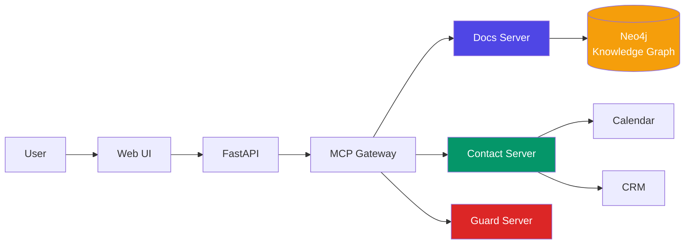

# Toll Aviation Chatbot — Planning Repository

> **Living technical plan** for building a trustworthy, AI-powered chatbot that serves Toll Aviation's customers with accurate information and seamless contact workflows.

---

## 🎯 What We're Building

A **dual-purpose chatbot** that combines knowledge retrieval with action completion:

### 📚 Ask-Docs
**Answers questions about Toll Aviation with verified citations**

- Company history and milestones
- Service offerings (UAS, ACE Training)
- Capabilities and platforms
- Programs and contracts

**How it works:** Hybrid search (vector + full-text + knowledge graph) with sentence-level verification ensures every answer is backed by approved Toll documents.

### 📞 Contact Actions
**Completes booking and inquiry workflows end-to-end**

- Book appointments with automatic calendar coordination
- Arrange phone calls with team routing
- Send inquiries to correct departments
- Capture leads in CRM

**How it works:** Intelligent triage routes each inquiry to the right team (Training, Media, Tenders, Operations) with GDPR-compliant data capture.

---

## 🚀 Quick Start

### 🎨 **New to the project?**
Start with the [**Overview**](00-overview/README.md) to understand scope and goals.

### 🏗️ **Building components?**
Check the [**Architecture**](60-architecture/architecture-v2.md) for system design.

### 🔧 **Implementing features?**
See [**Agents & MCP**](30-agents-mcp/README.md) for tool contracts.

---

## 📊 Success Criteria (MVP)

| Metric | Target | Why It Matters |
|--------|--------|----------------|
| **Citation Accuracy** | ≥ 95% | Trust — every answer must be verifiable |
| **Booking Latency** | ≤ 6s (p95) | Speed — fast enough for live conversation |
| **Completion Rate** | ≥ 60% | Conversion — users complete their bookings |
| **Uptime** | 99.5% | Reliability — always available when needed |

---

## 🧭 Documentation Map

### **Foundation**
- [**Overview**](00-overview/README.md) — High-level plan, scope, and non-goals
- [**Intents & Routing**](10-intents-routing/README.md) — How we classify and route user requests

### **Knowledge Layer**
- [**KG Schema**](20-kg-schema/README.md) — Neo4j graph structure for Toll Aviation data
- [**Retrieval & Verification**](40-retrieval-verification/README.md) — Hybrid search + sentence-level verification

### **Action Layer**
- [**Contact Flows**](50-contact-flows/README.md) — Booking, calls, and email workflows
- [**Agents & MCP**](30-agents-mcp/README.md) — Tool definitions and agent contracts

### **Infrastructure**
- [**Architecture**](60-architecture/architecture-v2.md) — System design (simplified MCP pattern)
- [**Tech Stack & Infra**](70-tech-stack-infra/README.md) — Technology choices and deployment

### **Cross-Cutting**
- [**Security & Privacy**](80-security-privacy/README.md) — PII handling, compliance, guardrails
- [**Roadmap & SLOs**](90-roadmap-slo/README.md) — Milestones and service level objectives

---

## 🏛️ Architecture at a Glance

**Key Design Decisions:**
- ✅ **No separate orchestrator** — Claude Host handles tool coordination
- ✅ **Stateless MCP servers** — Horizontal scaling, no bottlenecks
- ✅ **Observable by default** — OpenTelemetry spans on every request
- ✅ **PII-safe logging** — Automatic redaction at gateway level

[See full architecture →](60-architecture/architecture-v2.md)

---

## 🎯 Current Phase: MVP Development

### ✅ Completed
- [x] Repository structure and documentation framework
- [x] Architecture design (v2 with simplified MCP pattern)
- [x] Tool contracts and agent definitions
- [x] Security and privacy requirements

### 🚧 In Progress
- [ ] Neo4j schema implementation
- [ ] MCP server development (Docs, Contact, Guard, KG)
- [ ] Frontend UI prototyping
- [ ] Data ingestion pipeline

### 📋 Next Up
- [ ] Integration testing
- [ ] Observability setup (OpenTelemetry + Grafana)
- [ ] Load testing and optimization
- [ ] Internal beta deployment

---

## 🔒 Safety & Compliance

This chatbot is designed with **trust and safety** at its core:

- **Docs-only knowledge** — No external web browsing; answers come strictly from approved Toll documents
- **Operational guardrails** — Refuses SOP/medical/flight guidance; routes to official channels (1800 776 902)
- **PII protection** — Data minimization, explicit consent, 30-day retention, automatic redaction
- **Citation requirement** — Every sentence must be backed by a source, or it's dropped

[Read more about security & privacy →](80-security-privacy/README.md)

---

## 🤝 Contributing

This is a **living plan** — it evolves as we build and learn.

- **Format**: Markdown files organized by topic
- **Diagrams**: Mermaid for architecture and flow diagrams
- **Decisions**: Tracked via this documentation (ADR-style)
- **Versioning**: Git history provides full audit trail

### Making Changes
1. Edit markdown files in `docs/`
2. Test locally: `mkdocs serve`
3. Commit and push to `main`
4. GitHub Actions automatically deploys to [https://infinity-4u.github.io/toll-aviation-chatbot-plan/](https://infinity-4u.github.io/toll-aviation-chatbot-plan/)

---

## 📞 Contact & Support

- **Project Lead**: [Your Name/Team]
- **Repository**: [github.com/infinity-4u/toll-aviation-chatbot-plan](https://github.com/infinity-4u/toll-aviation-chatbot-plan)
- **Issues**: [Report bugs or request features](https://github.com/infinity-4u/toll-aviation-chatbot-plan/issues)

---

**💡 Pro Tip:** Use the left sidebar navigation to explore all sections. Each page includes links to related documentation for easy cross-referencing.

